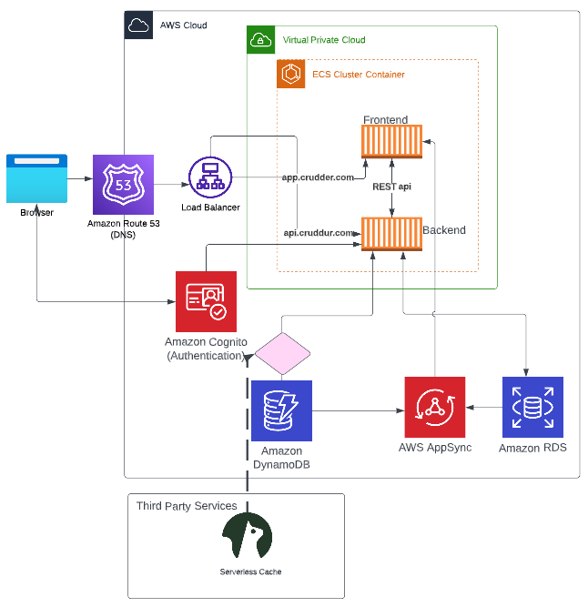

# Week 0 — Billing and Architecture

## Required Homework

### Install and verify AWS CLI
I refer to the instructions on the [AWS CLI Install Documentation Page](https://docs.aws.amazon.com/cli/latest/userguide/getting-started-install.html) and was able to install the AWS CLI on Linux using VScode and Gitpod by using the following commands.
```
curl "https://awscli.amazonaws.com/awscli-exe-linux-x86_64.zip" -o "awscliv2.zip"
unzip awscliv2.zip
sudo ./aws/install
```
I then downloaded my access key information from the AWS portal, and set up the information on Linux by using `aws configure` command, which asks for the Access Key ID, Secret Access Key, region and output (json).

Once I was able to connect to my AWS account successfully, I was able to confirm my ID by running `aws sts get-caller-identity`, which returned the following information:


### Setting up billing alarm
To make sure I am alerted when my cloud spend goes over the limit, I set up a billing alarm.

**Note to insert images**

### Create a budget
I created my own budget for $30 as well as the credit budget of $125 as I have $125 on my account for use. My user alias is blocked out for the Github upload.


Both the billing alarm and the budget were set through AWS CLI and the json files can be found on my Github. [Here](https://github.com/jayraphy/aws-bootcamp-cruddur-2023/blob/main/aws/json/budget.json) and [here](https://github.com/jayraphy/aws-bootcamp-cruddur-2023/blob/main/aws/json/alarm-config.json)

### Recreate Logical Architecture Design
I also recreated the logical architectural design using lucidchart


**Note to insert images**
[The design can be found here](https://lucid.app/lucidchart/invitations/accept/inv_963c2d36-ba9c-489d-9caf-dbbb59da31da)


### Homework challenges
